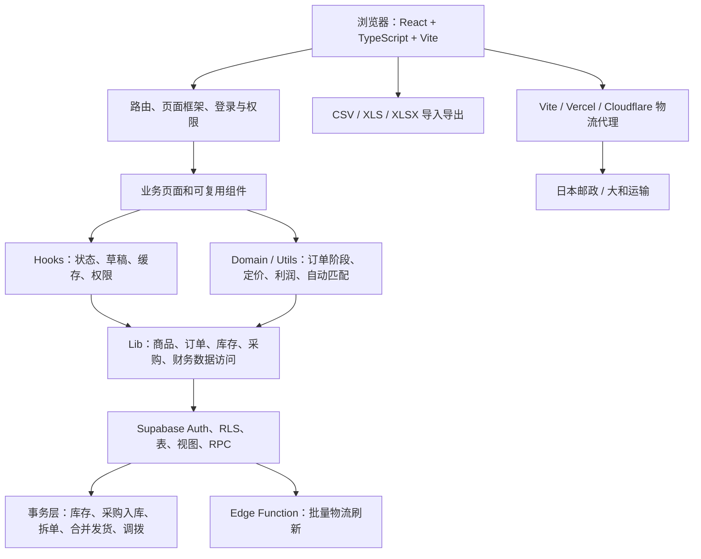

# 系统架构与页面功能说明

> 更新基线：2026-08-04，基于当前工作区代码。
>
> 阅读范围：`src/`、`supabase/`、`api/`、`cloudflare/`、`scripts/`、路由、部署与测试配置。
>
> 数据库事实来源：按文件名排序的 `supabase/migrations/`。`supabase/schema.sql` 是旧初始化快照，不能代表当前完整结构。

## 1. 项目概览

本项目是一个 **Temu 日本站半托管业务运营核算系统**。

它以商品与 SKU 为基础，连接核价、利润分析、采购入库、仓储库存、Temu 订单履约、物流追踪、平台结算和现金收支，形成以下四条主要业务链路：

1. 商品与参数 → 核算定价 → 利润分析 → 促销投放建议。
2. 采购建单 → 快递包裹 → 签收入库 → SKU 库存。
3. Temu 订单导入 → 拆单或合并发货 → 仓库物流分配 → 库存占用 → 发货 → 追踪 → 签收。
4. 实际运费与 Temu 结算导入 → 对账 → 利润报表 → 收支流水和现金流。

当前系统是一个浏览器端单页应用。页面通过 Supabase Data API、视图和 RPC 读写数据；复杂的库存、采购、拆单、合并发货、结算和财务聚合逻辑主要放在 PostgreSQL 函数中完成。

## 2. 总体架构



### 2.1 展示与路由层

- `src/main.tsx`：安装全局诊断、创建 React 根节点并挂载 `BrowserRouter`。
- `src/App.tsx`：定义所有路由、登录保护、错误边界和页面懒加载。
- `src/components/page-shell.tsx`：定义左侧主菜单、移动端导航、用户资料入口和退出登录。
- `src/pages/`：页面级控制器，负责加载数据、组合业务动作和维护页面状态。
- `src/components/`：商品表单、订单弹窗、财务面板、标准表格和通用 UI。

业务页面采用懒加载。访问根路径 `/` 时自动进入 `/orders`；除登录、找回密码和重置密码外，其他路由都要求有效 Supabase Session。

### 2.2 前端应用层

- `src/hooks/use-auth.ts`：读取 Session、监听登录状态变化，并切换用户级缓存作用域。
- `src/hooks/use-permissions.tsx`：加载 `admin`、`editor`、`viewer` 权限并提供编辑/删除能力。
- `src/hooks/useOrders.ts`：管理订单分页、筛选和页面数据装载。
- `src/hooks/use-draft-persistence.ts`：保存商品、利润、订单、采购和设置等未提交草稿。
- `src/lib/async-cache.ts`、`src/lib/cached-*.ts`：缓存商品、仓库、物流等参考数据；实时库存不依赖长期缓存。

系统没有 Redux 一类的集中状态库，主要使用页面状态、自定义 Hook、用户级异步缓存和浏览器草稿。

### 2.3 领域规则与纯计算层

- `src/domain/order-workflow.ts`：订单阶段、库存占用边界、包裹履约完整性。
- `src/domain/order-auto-match.ts`：单 SKU、3cm 包裹的仓库优先级自动匹配。
- `src/domain/order-customer-history.ts`：复购、退款订单和退款客户标记。
- `src/domain/order-tracking.ts`：承运商物流事实和业务阶段告警规则。
- `src/utils/pricing.ts`：采购成本、物流成本、补贴、核算价和目标利润。
- `src/utils/profit-calculation.ts`：折扣、优惠券、ROAS、广告费和广告后利润。
- `src/utils/multi-shipment-profit.ts`：多件直发和正常发货的包裹、运费与利润模拟。
- `src/utils/shipping-costs.ts`：头程、尾程、重量阶梯和件数阶梯计费。

### 2.4 数据访问层

`src/lib/` 按业务领域封装 Supabase 调用和文件处理：

| 模块 | 主要职责 |
| --- | --- |
| `products.ts` | 商品、配件、规格、SKU、BOM、导入导出 |
| `orders.ts` | Temu 订单、包裹、拆单、合并发货、补发、库存分配 |
| `inventory.ts` | 仓库、SKU 库存、调整流水、库存调拨 |
| `purchases.ts` | 采购单、来源、快递包裹、签收入库 |
| `finance-queries.ts` | 财务总览、流水和订单分析 RPC |
| `settlement.ts` | Temu 结算文件解析、导入和收入匹配 |
| `actual-shipping-fees.ts` | 实际尾程、头程月结、物流付款和作废记录 |
| `settings.ts` | 个人核价参数和物流公式配置 |
| `order-tracking.ts` | 物流告警、Edge Function 刷新和异常处理 |
| `order-file-import-templates.ts` | 订单、物流单号、发货表和 Temu 上传表模板 |

### 2.5 Supabase 数据库层

当前仓库共有 **105 个有序迁移**，从 `20260517000000_add_coupon_discount_rate.sql` 到 `20260802141246_fix_finance_revenue_deduplication.sql`。

数据库层承担：

- Supabase Auth 身份认证。
- RLS 和账号权限校验。
- 表、视图、触发器和索引。
- 原子库存扣减与回补。
- 采购建单、包裹签收和仓间调拨。
- 订单拆单、取消拆单、合并发货和取消合并。
- 订单分页、阶段计数、财务聚合和对账查询。
- 物流定时刷新、异常记录和 90 天诊断保留。

生产结构以 `supabase/migrations/` 为准，不能根据 `supabase/schema.sql` 或迁移文件是否存在推断生产环境已经部署。

### 2.6 外部集成与部署层

- CSV、XLS、XLSX：订单、物流单号、商品、实际运费、Temu 结算和各类模板导入导出。
- `supabase/functions/refresh-temu-tracking/`：批量刷新包裹物流状态。
- `api/yamato-tracking.mjs`：Vercel 上的大和运输登录用户代理。
- `cloudflare/worker.ts`：Cloudflare 物流代理链路。
- `vite.config.ts`：本地开发代理和前端拆包。
- `vercel.json`：生产物流重写和 SPA 路由回退。

## 3. 页面与路由功能

路由事实来源是 `src/App.tsx`，主菜单事实来源是 `src/components/page-shell.tsx`。

### 3.1 登录与账号

| 路径 | 页面 | 主要功能 |
| --- | --- | --- |
| `/login` | 账号登录 | 使用邮箱和密码登录；成功后进入管理系统。当前没有前端自助注册入口。 |
| `/forgot-password` | 找回密码 | 输入登录邮箱，发送 Supabase 密码恢复邮件。 |
| `/reset-password` | 设置新密码 | 从恢复邮件进入，设置不少于 8 位的新密码并退出旧会话。 |
| `/user` | 用户资料 | 查看和修改用户名；显示用户 ID、权限和商品创建者展示名称；查看并清空本次会话的脱敏诊断。 |
| `/admin/diagnostics` | 集中诊断 | 仅管理员访问；查看最近诊断、Web Vitals、慢请求、错误率和请求耗时分位数。 |

### 3.2 销售履约

| 路径 | 页面 | 主要功能 |
| --- | --- | --- |
| `/orders` | 订单管理 | 上传 Temu 订单表和物流单号；按流程管理订单；筛选仓库、物流方式、客户历史和异常；手动/自动分配仓库物流；拆单、合并发货、补发；占用或释放库存；下载发货表和 Temu 上传表；查询物流、处理异常并完成签收。 |

订单阶段由持久化事实推导，而不是只读取 `order_status`：

1. `pending_assignment`：待分配，仓库或尾程方式不完整，不占用库存。
2. `new_order`：新订单，仓库和尾程方式完整，已占用库存。
3. `pending_shipping`：待发货，已生成或记录面单时间。
4. `shipped`：已发货，存在实际发货时间或物流单号。
5. `uploaded_temu`：已标记上传 Temu。
6. `completed`：存在实际签收时间。

订单页面的主要动作：

- 上传订单表：支持 CSV/XLS/XLSX 映射模板、预览、去重和收件信息校验。
- 上传物流单号：普通包裹按订单号匹配；拆单包裹要求订单号和子订单号精确匹配。
- 批量分配：同一包裹统一使用仓库和稳定物流方式 ID。
- 自动匹配：只处理符合仓库优先级、单 SKU、3cm 数量上限、尾程分类和库存条件的普通包裹。
- 拆单：一个原订单拆成多个物理包裹，完整保存每件商品分配数量。
- 合并发货：多个收件信息一致的待分配原订单共享一个物理包裹，但保留各自订单身份。
- 创建补发：从原订单选择或增加 SKU，生成带后缀的新订单。
- 下载发货表格：按双工作表模板输出包裹/收件信息和商品申报信息。
- 下载上传表格：按模板输出订单号、子订单号、数量、物流单号、承运商和仓库。
- 物流追踪：手动或定时查询日本邮政/大和运输，保存轨迹事实、异常和签收时间。

### 3.3 财务与报表

| 路径 | 页面 | 主要功能 |
| --- | --- | --- |
| `/finance` | 财务总览 | 切换“经营核算”和“现金收支”；查看发货订单利润、结算进度、近 6 个月利润、真实现金流、物流待付款和异常订单。 |
| `/finance/ledger` | 收支流水 | 按全部、订单回款、采购付款、物流付款、其他费用分类；支持月份筛选和分页。 |
| `/finance/expenses` | 费用管理 | 维护平台佣金、退款损失、广告推广、关税头程、包装耗材和其他费用；支持广告费表格导入预览、覆盖或跳过冲突。 |
| `/finance/profit` | 利润报表 | 查看月度利润和商品利润；区分实际现金净额与发货口径利润；分析仓库、物流方式、票数、重量、估算头程、实际尾程和估算尾程。 |
| `/finance/settlement` | 结算与对账 | 管理 Temu 结算文件、对账异常、收入明细、实际尾程运费、头程月结和物流付款。 |

`/finance/settlement` 包含四个标签：

1. **结算文件**：上传、解析、导入和删除 Temu SettledParentFlow 文件。
2. **对账排查**：筛选 SKU 未匹配、运费缺失、结算缺失等问题订单。
3. **收入明细**：查看销售收入、运费收入、冲回、成本、运费和利润。
4. **物流商月结**：制作实际运费映射模板、上传尾程账单、确认月份实际头程、登记部分付款、查看和作废付款记录。

财务页面必须区分以下口径：

- **发货口径利润**：结算收入减商品成本、核算运费和期间费用。
- **实际现金净额**：真实平台回款减真实采购付款、物流付款和其他费用。
- **应收/未结算**：已发货但尚未完成平台结算的订单收入，不等于净现金流。

### 3.4 商品与核价

| 路径 | 页面 | 主要功能 |
| --- | --- | --- |
| `/products` | 商品管理 | 搜索和筛选售卖状态；查看尺寸、重量、材质和创建者；切换售卖状态；新增、编辑、删除商品；Excel 导入导出。 |
| `/products/new` | 新增商品 | 创建商品主资料、仓库 3cm 上限、组合配件、销售规格、SKU、图片和 SKU-BOM；支持草稿恢复。 |
| `/products/:productId/edit` | 编辑商品 | 查看或维护商品、规格、SKU、BOM 和仓库配送限制。 |
| `/declaration-prices` | 核算定价 | 按当前商品、配件成本和参数实时显示采购成本、物流成本、总成本、利润和核算定价。 |
| `/products/:productId/pricing` | 核算定价结果 | 逐 SKU 展示成本、物流方案、补贴、核算价、利润和利润率，并可保存结果。 |

商品结构关系：

- `products`：商品主资料、包装尺寸、重量和申报资料。
- `product_items`：商品使用的采购配件及采购成本。
- `product_skus`：最终销售 SKU、销售属性和 Temu 图片。
- `product_sku_items`：SKU 与配件之间的 BOM 数量关系。
- `product_warehouse_shipping_limits`：商品在各仓库的 3cm 每包最大数量。

### 3.5 利润与发货测算

| 路径 | 页面 | 主要功能 |
| --- | --- | --- |
| `/profit-calculation` | 利润分析总览 | 结合核价、流量加速、活动折扣、优惠券、ROAS 和广告费计算最终售价、利润和安全边际；支持筛选、排序、保存和下载表格。 |
| `/products/:productId/profit-calculation` | 单商品利润分析 | 逐 SKU 修改核价及折扣参数，对比物流方案、广告费、利润率、失补状态和免邮件数。 |
| `/profit-calculation/recommendations` | 促销投放推荐 | 根据成本和利润设置给出流量加速、优惠券、活动折扣和广告建议；不可推荐商品单独列出原因。 |
| `/test-shipping` | 直发测算 | 比较顺丰入仓、OCS 3cm/小包等物流成本和含广告后的利润表现。 |
| `/profit-calculation/direct-shipping` | 多件直发商品列表 | 显示商品、包装尺寸、重量、3cm 每包上限和可用状态。 |
| `/profit-calculation/direct-shipping/:productKey` | 多件直发利润 | 按件数递增计算包裹数、候选物流、采购成本、入仓顺丰、广告费和利润，直到出现亏损。 |
| `/profit-calculation/standard-shipping` | 多件正常发货商品列表 | 选择要进行多件正常发货测算的商品。 |
| `/profit-calculation/standard-shipping/:productKey` | 多件正常发货利润 | 按件数模拟正常发货成本和利润，不计直发模式特有的入仓顺丰成本。 |

### 3.6 采购与仓储

| 路径 | 页面 | 主要功能 |
| --- | --- | --- |
| `/purchases/new` | 新增采购管理单 | 选择仓库、采购日期、商品和 SKU；记录 1688 订单号、采购链接、数量、单价、运费及来源。 |
| `/purchases/records` | 采购管理记录 | 搜索和分页；查看包裹和签收进度；补录快递单号；按包裹或剩余数量签收入库；维护历史缺失 SKU；管理员可删除。 |
| `/inventory` | 仓储总览 | 查看仓库、SKU 数量和物流绑定；新增、重命名或删除仓库；设置仓库自动匹配参与状态和唯一优先级。 |
| `/inventory/:warehouseSlug` | 单仓库存 | 搜索商品和 SKU；查看 SKU 库存和 BOM 推导配件；增加/移除商品；校准库存并填写原因；维护仓库物流配置。 |
| `/inventory/transfer` | 库存调拨 | 创建源仓到目标仓的 SKU 调拨；创建时扣减源仓，签收后增加目标仓；记录日期、物流单号和调拨轨迹。 |

库存的主要变化来源：

- 采购包裹签收入库。
- 仓间调拨发出和签收。
- 订单包裹分配后的库存占用。
- 订单退回待分配、取消占用或删除时的库存回补。
- 管理员或编辑者进行的手工库存校准。

所有库存变化都应保留 `warehouse_sku_stock_adjustments` 审计流水。

### 3.7 系统配置与特殊路由

| 路径 | 页面 | 主要功能 |
| --- | --- | --- |
| `/parameter-settings` | 参数设置 | 设置包装成本、汇率、Temu 补贴、目标利润率和广告后利润率；配置头程、尾程、计费公式、币种、计费单位、件数阶梯、3cm 分类及默认核价方案。 |
| `/` | 根路径 | 自动跳转到 `/orders`。 |
| `/finance/books` | 旧地址兼容 | 跳转到 `/finance/ledger`。 |
| `/finance/cashflow` | 旧地址兼容 | 跳转到 `/finance/ledger`。 |
| `/finance/reconciliation` | 旧地址兼容 | 跳转到 `/finance/settlement`。 |
| `*` | 页面不存在 | 显示 404 页面并提供返回商品管理入口。 |

## 4. 权限与数据边界

### 4.1 前端权限

| 权限 | 前端能力 |
| --- | --- |
| `admin` | 可查看、编辑和删除 |
| `editor` | 可查看和编辑，不可删除 |
| `viewer` | 只读查看 |

`PermissionGate` 控制部分编辑路由；各业务页面还根据 `canEdit`、`canDelete` 控制按钮。前端控制不是最终安全边界，数据库 RLS 与 RPC 必须继续执行服务端校验。

### 4.2 数据作用域

- 商品、订单、采购、仓库、物流和库存属于同一运营团队并共享可见。
- 新写入的团队运营记录保留创建者 `owner_id`，不允许任意转移所有者。
- 费用、结算、用户资料和个人核价参数主要按登录用户隔离。
- 当前没有独立公司或租户维度；如果未来支持多个运营团队，需要增加 tenant/company 边界并重审全部 RLS。

### 4.3 Supabase 安全边界

- 浏览器只使用 `VITE_SUPABASE_URL` 和公开客户端 Key；严禁暴露 service role。
- exposed schema 中的表应启用 RLS，并同时检查 Data API 授权。
- 视图优先使用 `security_invoker`，避免绕过调用者 RLS。
- 事务业务函数优先保持 `SECURITY INVOKER`。
- 权限函数和服务端代理必须继续验证 Supabase Session。

## 5. 数据库结构概览

| 领域 | 主要表/视图 | 用途 |
| --- | --- | --- |
| 身份与运维 | `auth.users`、`account_permissions`、`account_profiles`、`app_diagnostics` | 登录身份、角色、用户资料和脱敏诊断 |
| 商品 | `products`、`product_items`、`product_skus`、`product_sku_items` | 商品、配件、SKU 和 BOM |
| 核价 | `pricing_settings`、`pricing_results`、`profit_calculations`、`product_warehouse_shipping_limits` | 个人参数、核价结果、利润参数和 3cm 上限 |
| 仓库与物流 | `warehouses`、`logistics_methods`、`warehouse_logistics_methods`、`order_auto_match_settings` | 仓库、物流主数据、仓库绑定和自动匹配配置 |
| 库存 | `warehouse_skus`、`warehouse_sku_stock_adjustments` | 仓库 SKU 余额与调整审计 |
| 旧配件库存 | `warehouse_item_stocks`、`warehouse_item_stock_adjustments` | 兼容早期配件库存；当前主页面以 SKU 库存推导配件数量 |
| 采购 | `purchase_orders`、`purchase_order_sources`、`purchase_order_items`、`purchase_packages`、`purchase_package_items` | 采购单、1688 来源、采购明细、包裹和签收分配 |
| Temu 原始订单 | `temu_orders` | 原订单、子订单、SKU、收件信息和时限 |
| 包裹履约 | `temu_order_shipments`、`temu_order_shipment_items`、`temu_order_fulfillment_lines` | 包裹、包裹商品和前端统一履约视图 |
| 订单库存 | `temu_order_sku_inventory_reservations` | 包裹商品到仓库 SKU 的活动/已释放库存占用 |
| 拆单 | `temu_order_split_events` | 拆单和取消拆单的前后快照 |
| 合并发货 | `temu_order_combined_shipments`、`temu_order_combined_shipment_members` | 多原订单共享一个物理包裹并指定唯一主订单 |
| 文件模板 | `temu_order_file_import_templates`、`finance_actual_shipping_fee_import_templates` | 订单、物流、导出和实际运费映射模板 |
| 费用与结算 | `finance_expenses`、`finance_settlement_files`、`finance_settlement_records` | 期间费用、Temu 结算文件和结算事实 |
| 实际尾程 | `finance_actual_shipping_fees`、`finance_logistics_settlements`、`finance_logistics_payments` | 包裹实际尾程、物流商月结应付和付款 |
| 实际头程 | `finance_first_leg_monthly_settlements`、`finance_first_leg_payments` | 月份级实际头程确认、部分付款和作废记录 |

### 5.1 重要的非外键关联

- 订单通过 `sku_code` 或销售规格匹配内部 SKU。
- Temu 结算通过 `po_number` 匹配 `order_no`。
- 实际运费以物流方式 ID 和物流单号识别物理包裹。
- 旧数据同时保存物流名称和 `logistics_method_id`；稳定业务身份应使用 ID。

这些文本关联是数据质量风险，需要在导入预览和数据库 RPC 中共同校验。

## 6. 关键业务流程

### 6.1 订单从导入到结算

1. 用户通过映射模板上传 Temu 订单表。
2. `importTemuOrders` 去重并写入 `temu_orders`。
3. 数据库建立默认 `temu_order_shipments` 和 `temu_order_shipment_items`。
4. 页面通过 `temu_order_fulfillment_lines` 和 `get_temu_orders_page` 读取包裹履约行。
5. 待分配订单可以保持普通包裹、拆成多个包裹，或与其他合格订单合并为一个物理包裹。
6. 分配仓库和尾程时，事务 RPC 校验配置与库存，扣减 `warehouse_skus` 并写 reservation 和 adjustment。
7. 面单时间推进到待发货；物流单号或实际发货时间推进到已发货。
8. 下载 Temu 上传表后，人工标记为上传 Temu。
9. 前端或定时任务刷新物流，承运商事实写回包裹；签收时间推进订单完成。
10. 实际尾程账单按物流方式 ID 和物流单号匹配物理包裹；合并包裹只在主订单计费一次。
11. Temu 结算文件按原始订单号匹配收入；拆包不重复回款，合并发货中的不同原订单分别计收入。
12. 财务 RPC 按发货月份聚合收入、商品成本、头尾程、期间费用、现金收付款和问题项。

### 6.2 采购与库存

1. `create_purchase_order_atomic` 写入采购单、来源和采购明细。
2. `create_purchase_package` 将采购明细数量分配到快递包裹。
3. `receive_purchase_package_atomic` 锁定包裹和库存，增加目标仓 SKU 并记录调整流水。
4. 库存页面读取 `warehouse_skus`；配件数量通过 BOM 乘以 SKU 库存推导。
5. 调拨发出 RPC 原子扣减源仓；调拨签收 RPC 增加目标仓。
6. 订单包裹分配时扣减可用库存并创建活动占用。
7. 订单退回待分配或取消有效占用时恢复库存并释放 reservation。

### 6.3 财务月份和口径

- 订单经营分析以实际发货时间归属月份。
- 结算收入按原始订单号每单归属一次。
- 尾程费用按物理包裹计一次，不能按订单明细重复。
- 物流付款在利润报表中按对应 `shipping_month` 归属物流成本月份；`paid_at` 保留为真实付款日期。
- 实际头程只保存月份合计，不向订单、商品、仓库或物流方式人为分摊。
- 月份确认实际头程后，月度利润总额使用实际头程替换该月估算头程；分组明细继续标明估算口径。
- 总运费口径为：估算头程 + 实际尾程 + 估算尾程；实际尾程与估算尾程互斥。

## 7. 文件导入导出架构

### 7.1 模板类型

| 模板 | 方向 | 用途 |
| --- | --- | --- |
| 订单表模板 | 表格 → 网站 | 上传 Temu 订单和收件信息 |
| 物流单号模板 | 表格 → 网站 | 给待发货包裹写入物流单号 |
| Temu 上传模板 | 网站 → 表格 | 生成 Temu 发货上传文件 |
| 发货表模板 | 网站 → 双工作表 | 输出包裹/收件信息和商品申报信息 |
| 实际运费模板 | 表格 → 网站 | 导入物流单号、实际尾程金额和物流方式 |

### 7.2 共同规则

- 支持 CSV、XLS、XLSX。
- 列号按 1 开始，代码数组按 0 开始。
- 模板记录工作表、数据开始行、目标字段、目标列或固定值。
- 系统模板使用软删除，避免下次初始化重新生成。
- 预览成功不代表允许写入，确认导入时数据库仍需校验冲突、状态和稳定 ID。
- 下载流程只在浏览器内生成文件，不应改变订单阶段、库存或物流配置。

## 8. 部署与环境

### 8.1 Vite 与 Vercel

- `npm run build` 执行 TypeScript 构建和 Vite 生产打包，输出 `dist/`。
- `vite.config.ts` 按 React、Supabase、Router、图标、Excel和页面拆包。
- 本地 `/yamato-tracking` 和 `/japanpost-tracking` 由 Vite 代理。
- 生产 `/yamato-tracking` 由 Vercel Function 校验登录用户后代理。
- 生产 `/japanpost-tracking` 通过 `vercel.json` 重写到日本邮政。
- 最后的 SPA rewrite 将其他路径返回 `/index.html`，支持前端路由刷新。

### 8.2 Edge Function 与 Cloudflare

- Supabase `refresh-temu-tracking` 负责批量或定时追踪，不经过浏览器 Vite 代理。
- Edge Function 查询日本邮政，并通过受密钥保护的 Cloudflare 代理查询大和运输。
- 本地代理、Vercel 代理和定时 Edge Function 是不同链路，必须分别验证。

### 8.3 主要环境变量

| 变量 | 用途 |
| --- | --- |
| `VITE_SUPABASE_URL` | 浏览器 Supabase Project URL |
| `VITE_SUPABASE_ANON_KEY` | 浏览器公开客户端 Key，受 RLS 约束 |
| `SUPABASE_URL` | Vercel/Cloudflare 服务端连接 Supabase |
| `SUPABASE_ANON_KEY` | 服务端代理验证用户或代理密钥 |
| `SUPABASE_SERVICE_ROLE_KEY` | 本地快照和受控服务端任务，严禁进入浏览器 |
| `VITE_APP_VERSION` | 诊断记录中的应用版本 |
| `SUPABASE_SYNC_EMAIL` / `SUPABASE_SYNC_PASSWORD` | 无 service role 时的本地快照同步账号 |
| `E2E_BASE_URL`、`E2E_USER_EMAIL`、`E2E_USER_PASSWORD` | 登录态端到端测试 |
| `SUPABASE_ACCESS_TOKEN`、`SUPABASE_DB_PASSWORD`、`SUPABASE_PROJECT_ID` | 数据库发布工作流 |

### 8.4 本地数据快照

`npm run sync:data` 将 Supabase 数据分页导出到 `local-data/codex-supabase-data.json`。

快照顶层包含：

- `exported_at`
- `auth_mode`
- `user`
- `tables`
- `skipped_tables`
- `summary`

当前同步清单已经覆盖包裹、包裹商品、合并发货、履约视图和头程月结等近期运行时数据。`local-data/` 必须保持 Git 忽略，不能提交。

## 9. 平台耦合与扩展边界

| 模块 | Temu 耦合度 | 可复用部分 | 新平台需要调整 |
| --- | --- | --- | --- |
| 商品、配件、SKU | 中 | 商品核心、BOM、包装资料 | 平台标题、图片、平台 SKU 映射 |
| 核价与利润 | 高 | 成本项、物流公式、目标利润框架 | 补贴、币种、申报价、活动和广告规则 |
| 订单导入与状态 | 很高 | 文件模板和分页组件 | 原始字段、导入器、状态映射和平台回传 |
| 包裹履约 | 中高 | 包裹、包裹商品、拆单、合并概念 | 从 `temu_*` 抽离并关联通用订单行 |
| 物流追踪 | 高 | 追踪分类和异常提醒框架 | 承运商、代理、平台阶段规则 |
| 采购与仓储 | 低 | 采购、包裹入库、SKU库存和调拨 | 订单占用引用需改为通用履约来源 |
| 费用与现金流水 | 低到中 | 费用、收入/支出流水、物流付款 | 平台佣金、退款和科目映射 |
| 结算与利润报表 | 高 | 聚合和对账框架 | 结算解析、收入事实和 SQL 联结 |
| 登录、权限、诊断 | 低 | Auth、角色、资料和诊断 | 多团队场景的租户边界 |

如果未来接入其他平台，建议先建立平台账号、标准订单、平台 SKU 映射、通用履约和标准财务事实层，而不是继续复制一套平台专用订单、库存和财务页面。

## 10. 当前技术债务与维护重点

| 优先级 | 问题 | 影响 |
| --- | --- | --- |
| 高 | 缺少平台抽象 | `TemuOrderRecord`、`temu_*` RPC、状态和结算逻辑贯穿全栈，新平台接入成本高。 |
| 高 | 订单、结算和运费仍有文本匹配 | `sku_code`、`order_no`、`po_number`、物流单号需要规范化和冲突队列。 |
| 高 | 部署链路并存 | Vite、Vercel、Supabase Edge Function 和 Cloudflare 的职责不同，单链路成功不能代表全部正常。 |
| 中高 | 大型页面文件 | `orders-page.tsx`、`purchases-page.tsx`、`inventory-page.tsx` 已达到约 2200–3500 行，修改影响面大。 |
| 中高 | TypeScript 与 SQL 双重财务实现 | 核价和前端利润公式与数据库财务聚合需要合同测试保持一致。 |
| 中高 | 数据库基线与兼容路径 | `schema.sql` 过旧，前端仍有部分缺列/缺 RPC 兼容分支。 |
| 中 | 日期字段不统一 | 部分 Temu 时间仍以文本保存，需要前后端多套解析回退。 |
| 中 | 物流参数双重建模 | 个人设置 JSON 与物流主表、仓库绑定同时存在，依赖同步和稳定 ID。 |
| 中 | 浏览器草稿不能跨设备 | 草稿主要保存在 localStorage/sessionStorage。 |
| 中 | 当前权限只有单运营团队 | 没有 tenant/company 边界，不能直接支持多个独立组织。 |

## 11. 修改与验证边界

涉及以下领域时，不能只检查页面差异：

- 订单阶段：同时检查前端 `getOrderStage`、SQL 阶段函数、分页 RPC 和 Edge Function。
- 库存：同时检查余额、reservation、adjustment、事务 RPC 和并发锁。
- 拆单/合并发货：同时检查包裹、库存、追踪、导入导出和财务一次计费。
- 财务：使用同一组订单对比财务总览、利润报表、结算页和流水页。
- Supabase 结构：检查迁移、RLS、授权、索引、类型、显式查询字段和快照同步覆盖。
- 物流代理：分别验证本地浏览器、Vercel、Supabase Edge Function 和 Cloudflare。

常用验证命令：

```bash
npm run test
npm run build
npm run lint
npm run check:migrations
npm run check:rpc-contracts
npm run check:rpcs
npm run check:data-coverage
npm run check:inventory
```

本文档本次更新只整理当前代码架构和页面功能，没有执行数据库写入，也没有把文档审查等同于真实登录浏览器回归。
